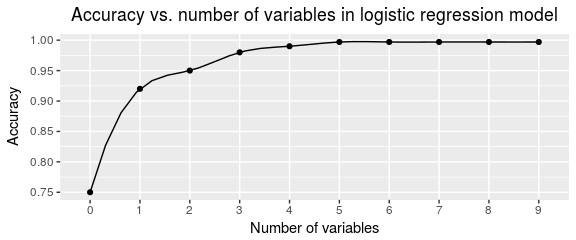
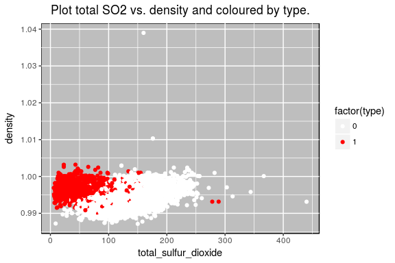

Wines quality and classification - Logistic Regression
================

Introduction
============

Oh!, a wine factory is going to receive a new pack of different wines and they do not have their type labelled (red or white). Ok, don't worry, we can go through each of the wines, look at it color, and label it. But... we would like to do this process automatically. In the following lines, we will face a classification problem to predict if the wine is red or white, depending on its physicochemical attributes.

A classification problem relates input variables *x* to the output variable *y*, but now *y* can take only discrete values, instead of continuous variables as in regression. When *y* can only take two discrete, it is called binary classification. We will denote these values as *y* ∈ {0, 1} in the rest of the report, where 0 ≡ white class and 1 ≡ red type.


Loading the data
================

The data science pipeline often needs to split the original dataset into two smaller pieces: the train and test datasets. If we only evaluate our models in the same dataset, the results will be overestimated (aka overfitting). To provide honest assesments of the performance of the predictive models, we will need to validate the models using a test dataset, a partition that has not been used to build the models in order to avoid bias.

``` r
# Loading the dataset into a dataframe
df <- read_delim("../../data/processed/wines.csv", 
  ";", 
  escape_double = FALSE, 
  trim_ws = TRUE)

# Train and test dataset, split 80%.
split <- nrow(df)*0.8
train <- df[1:split,]
test <- df[split:nrow(df),]
```

In this case, the test dataset consists of the 20% of the dataset (1300 observations).

Logistic Regression Model
=========================

The equivalent linear regression model in classification is the logistic regression model. This model needs to specify a function such that p(y=0|X) and p(y=1|X) are both greater than 0 and sum 1. The logistic function has such properties, definining the following model:


If *β*<sub>*i*</sub> &gt; 0 then increasing one unit in *x*<sub>*i*</sub> will increase the probability of a success. If *β*<sub>*i*</sub> &lt; 0, then the probabilty of success decrease when increasing *x*<sub>*i*</sub>. When *β*<sub>*i*</sub> = 0 , *e*<sup>0</sup> = 1, so the odds do not change with *x*<sub>*i*</sub>.

Full model
----------

We start by defining a logistic regression model with all the 11 attributes as the predictors. We do not use the `quality`, used in regression, and neither the `type`, used as the target variable *y*:

``` r
# Logistic regression model with all the variables.
log.full <- glm(type~fixed_acidity+volatile_acidity
             +citric_acid+residual_sugar+chlorides
             +free_sulfur_dioxide+total_sulfur_dioxide+density
             +pH+sulphates+alcohol, data=train, family=binomial)
summary(log.full)
```

    ## 
    ## Call:
    ## glm(formula = type ~ fixed_acidity + volatile_acidity + citric_acid + 
    ##     residual_sugar + chlorides + free_sulfur_dioxide + total_sulfur_dioxide + 
    ##     density + pH + sulphates + alcohol, family = binomial, data = train)
    ## 
    ## Deviance Residuals: 
    ##     Min       1Q   Median       3Q      Max  
    ## -6.3771  -0.0598  -0.0181  -0.0008   5.6422  
    ## 
    ## Coefficients:
    ##                        Estimate Std. Error z value Pr(>|z|)    
    ## (Intercept)          -1.879e+03  2.000e+02  -9.395  < 2e-16 ***
    ## fixed_acidity        -4.540e-01  2.442e-01  -1.859   0.0630 .  
    ## volatile_acidity      6.521e+00  1.097e+00   5.944 2.79e-09 ***
    ## citric_acid          -2.007e+00  1.237e+00  -1.623   0.1046    
    ## residual_sugar       -1.010e+00  1.118e-01  -9.038  < 2e-16 ***
    ## chlorides             2.003e+01  4.256e+00   4.705 2.54e-06 ***
    ## free_sulfur_dioxide   6.941e-02  1.376e-02   5.045 4.55e-07 ***
    ## total_sulfur_dioxide -5.270e-02  5.362e-03  -9.828  < 2e-16 ***
    ## density               1.879e+03  2.038e+02   9.222  < 2e-16 ***
    ## pH                   -2.002e+00  1.517e+00  -1.320   0.1868    
    ## sulphates             2.350e+00  1.300e+00   1.808   0.0706 .  
    ## alcohol               2.027e+00  3.022e-01   6.706 2.00e-11 ***
    ## ---
    ## Signif. codes:  0 '***' 0.001 '**' 0.01 '*' 0.05 '.' 0.1 ' ' 1
    ## 
    ## (Dispersion parameter for binomial family taken to be 1)
    ## 
    ##     Null deviance: 5808.4  on 5195  degrees of freedom
    ## Residual deviance:  369.6  on 5184  degrees of freedom
    ## AIC: 393.6
    ## 
    ## Number of Fisher Scoring iterations: 9

At first sight, each of the coeffiecient has a marginal test which attempts the null hypothesis *H*<sub>0</sub>: *β*<sub>*i*</sub> = 0, after adjusting the coefficients within the model. That means, it is checked the net effect of each variable and whether should be in the model or not. All the *p*-values are small enough to reject *H*<sub>0</sub> (considering *α* = 0.05) except for `citric_acid` (0.12) and `sulphates` (0.249). Let us discard these two variables in the further analysis:

``` r
# Logistic regression model with all the variables.
log.F <- glm(type~fixed_acidity+volatile_acidity
             +residual_sugar+chlorides
             +free_sulfur_dioxide+total_sulfur_dioxide+density
             +pH+alcohol, data=train, family=binomial)
summary(log.F)
```

    ## 
    ## Call:
    ## glm(formula = type ~ fixed_acidity + volatile_acidity + residual_sugar + 
    ##     chlorides + free_sulfur_dioxide + total_sulfur_dioxide + 
    ##     density + pH + alcohol, family = binomial, data = train)
    ## 
    ## Deviance Residuals: 
    ##     Min       1Q   Median       3Q      Max  
    ## -7.0929  -0.0609  -0.0194  -0.0008   5.5372  
    ## 
    ## Coefficients:
    ##                        Estimate Std. Error z value Pr(>|z|)    
    ## (Intercept)          -2.046e+03  1.768e+02 -11.574  < 2e-16 ***
    ## fixed_acidity        -6.398e-01  2.260e-01  -2.832  0.00463 ** 
    ## volatile_acidity      6.992e+00  9.686e-01   7.219 5.23e-13 ***
    ## residual_sugar       -1.062e+00  1.052e-01 -10.089  < 2e-16 ***
    ## chlorides             1.782e+01  4.128e+00   4.316 1.59e-05 ***
    ## free_sulfur_dioxide   7.232e-02  1.355e-02   5.336 9.51e-08 ***
    ## total_sulfur_dioxide -5.344e-02  5.203e-03 -10.271  < 2e-16 ***
    ## density               2.047e+03  1.801e+02  11.365  < 2e-16 ***
    ## pH                   -2.196e+00  1.418e+00  -1.548  0.12158    
    ## alcohol               2.249e+00  2.617e-01   8.594  < 2e-16 ***
    ## ---
    ## Signif. codes:  0 '***' 0.001 '**' 0.01 '*' 0.05 '.' 0.1 ' ' 1
    ## 
    ## (Dispersion parameter for binomial family taken to be 1)
    ## 
    ##     Null deviance: 5808.37  on 5195  degrees of freedom
    ## Residual deviance:  376.32  on 5186  degrees of freedom
    ## AIC: 396.32
    ## 
    ## Number of Fisher Scoring iterations: 11

All the marginal tests are now significantly small and the overall fit of the model is high enough (*p* = 1) testing against a Chi-Squared Distribution (pchisq), so we do not have evidence to reject the model in favor of the simple constant model.

``` r
pchisq(log.F$deviance, log.F$df.residual, lower=F)
```

    ## [1] 1

Validation
----------

We will define the following function to validate the correctness of the model. It basically counts the number of correctly classified observations, and it is divided by the total number of examples.

``` r
accuracy <- function(model, train, test){
  # Train error
  train_prob <- model$fitted
  train_prob <- ifelse(train_prob>0.5,1,0)
  d_train <- table(train_prob, train$type)
  
  # Test error
  test_prob <- predict(model, newdata = test, type = "response")
  test_prob <- ifelse(test_prob>0.5,1,0)
  d_test <- table(test_prob, test$type)
  
  train_accuracy <- sum(diag(d_train))/sum(d_train)
  test_accuracy <- sum(diag(d_test))/sum(d_test)
  
  return(list("train" = train_accuracy, "test" = test_accuracy))
}
```


Hence, with the full model we obtain an accuracy of 99% in both train and test dataset. This can be explained by the fact that the `type` of a wine is clearly defined by a combination of its chemical properties, as expected.

``` r
log.F.error <- accuracy(log.F, train, test)
log.F.error$train
```

    ## [1] 0.9944188

``` r
log.F.error$test
```

    ## [1] 0.9953846

Simpler Model
-------------

Though we obtain a satisfactory accuracy using almost all the variables of the dataset, we would like to find out a simpler model, where just a few attributes were used. This would lead to a more understandable model, easy to interpret and efficient. For instance, we could agree that an optimal model is the one which provides, at least, a 95% of correct classification.

Let us start with the simplest model. Since we know that the classes are a bit unbalanced, let us start with the model which sets all the labels to 1.

``` r
log.B <- glm(type~1, data=train, family=binomial)
accuracy(log.B, train, test)
```

    ## $train
    ## [1] 0.7530793
    ## 
    ## $test
    ## [1] 0.7584615

A bit more than 75% of accuracy just by guessing that all the wines will be red. However, we are not using the chemical information. Let us now include one of the variables to the logistic model. Which one? The one which decreases the most the AIC. The AIC is a measure of the quality of different models, relative to each of the other models. Ideal for model selection.

The function `step` in R does this task for us: it chooses a model by AIC in a stepwise algorithm. We would use it in the forward direction: it starts by the simplest constant model, and it tries to achieve the best model up to the full model, previously defined. Since we will go step by step, we will set the number of `steps` manually, to see what happens in each level.

``` r
#Stepwise algorithm
step(log.B, scope=list(upper=log.F), direction="forward", step=1)
```

    ## Start:  AIC=5810.37
    ## type ~ 1
    ## 
    ##                        Df Deviance    AIC
    ## + total_sulfur_dioxide  1   2295.0 2299.0
    ## + volatile_acidity      1   3399.3 3403.3
    ## + chlorides             1   3824.1 3828.1
    ## + free_sulfur_dioxide   1   4183.8 4187.8
    ## + fixed_acidity         1   4607.1 4611.1
    ## + residual_sugar        1   4869.3 4873.3
    ## + density               1   4957.7 4961.7
    ## + pH                    1   5213.2 5217.2
    ## + alcohol               1   5805.9 5809.9
    ## <none>                      5808.4 5810.4
    ## 
    ## Step:  AIC=2299.05
    ## type ~ total_sulfur_dioxide

    ## 
    ## Call:  glm(formula = type ~ total_sulfur_dioxide, family = binomial, 
    ##     data = train)
    ## 
    ## Coefficients:
    ##          (Intercept)  total_sulfur_dioxide  
    ##              4.51168              -0.06371  
    ## 
    ## Degrees of Freedom: 5195 Total (i.e. Null);  5194 Residual
    ## Null Deviance:       5808 
    ## Residual Deviance: 2295  AIC: 2299

Looking at the output, we observe that the best attribute to build a logistic regression with just a single variable is the `total_sulfur_dioxide`. The accuracy of the logistic regression variable for both train and test datasets is 92%! So finally, `type` is almost a matter of sulfur in the liquid. This is, nevertheless, not a surprise, since the most correlated variable with respect to the `type` is also this one:

``` r
log.1 <- glm(type~total_sulfur_dioxide, data=train, family=binomial)
accuracy(log.1, train, test)
```

    ## $train
    ## [1] 0.9255196
    ## 
    ## $test
    ## [1] 0.9261538

``` r
cor(df, df$type)
```

    ##                             [,1]
    ## fixed_acidity         0.48724238
    ## volatile_acidity      0.65270551
    ## citric_acid          -0.18644067
    ## residual_sugar       -0.34885917
    ## chlorides             0.51243909
    ## free_sulfur_dioxide  -0.47258513
    ## total_sulfur_dioxide -0.70037221
    ## density               0.39067606
    ## pH                    0.32934670
    ## sulphates             0.48776481
    ## alcohol              -0.03254018
    ## quality              -0.11889034
    ## type                  1.00000000

### Two variables model (95% accuracy)

Let us include one more variable to the last model and see what happens:

``` r
#Stepwise algorithm
step(log.1, scope=list(upper=log.F), direction="forward", step=1)
```

    ## Start:  AIC=2299.05
    ## type ~ total_sulfur_dioxide
    ## 
    ##                       Df Deviance    AIC
    ## + volatile_acidity     1   1364.5 1370.5
    ## + density              1   1392.8 1398.8
    ## + chlorides            1   1561.7 1567.7
    ## + fixed_acidity        1   1976.9 1982.9
    ## + alcohol              1   2078.7 2084.7
    ## + pH                   1   2115.7 2121.7
    ## + residual_sugar       1   2258.5 2264.5
    ## + free_sulfur_dioxide  1   2277.3 2283.3
    ## <none>                     2295.1 2299.1
    ## 
    ## Step:  AIC=1370.46
    ## type ~ total_sulfur_dioxide + volatile_acidity

    ## 
    ## Call:  glm(formula = type ~ total_sulfur_dioxide + volatile_acidity, 
    ##     family = binomial, data = train)
    ## 
    ## Coefficients:
    ##          (Intercept)  total_sulfur_dioxide      volatile_acidity  
    ##             -0.38319              -0.06374              12.92689  
    ## 
    ## Degrees of Freedom: 5195 Total (i.e. Null);  5193 Residual
    ## Null Deviance:       5808 
    ## Residual Deviance: 1364  AIC: 1370

The AIC decays the most with the inclusion of `density`, reaching an accuracy of 95%. Using just two variables of the dataset, we are just wrong in 58 classifications (21 should have been red, and 37 white) up to a total of 1300 observations.

``` r
log.2 <- glm(type~total_sulfur_dioxide+density, data=train, family=binomial)
accuracy(log.2, train, test)
```

    ## $train
    ## [1] 0.9590069
    ## 
    ## $test
    ## [1] 0.9615385

The odds can be interpreted such that the `density` contributes to the probability of getting a red wine (success) while the `total_sulphur_dioxide` increases the probability of being classified as a whine type, controlling for the other variable.

``` r
summary(log.2)
```

    ## 
    ## Call:
    ## glm(formula = type ~ total_sulfur_dioxide + density, family = binomial, 
    ##     data = train)
    ## 
    ## Deviance Residuals: 
    ##     Min       1Q   Median       3Q      Max  
    ## -7.1282  -0.1863  -0.0646  -0.0035   5.7485  
    ## 
    ## Coefficients:
    ##                        Estimate Std. Error z value Pr(>|z|)    
    ## (Intercept)          -7.057e+02  3.212e+01  -21.97   <2e-16 ***
    ## total_sulfur_dioxide -7.118e-02  2.461e-03  -28.93   <2e-16 ***
    ## density               7.147e+02  3.238e+01   22.07   <2e-16 ***
    ## ---
    ## Signif. codes:  0 '***' 0.001 '**' 0.01 '*' 0.05 '.' 0.1 ' ' 1
    ## 
    ## (Dispersion parameter for binomial family taken to be 1)
    ## 
    ##     Null deviance: 5808.4  on 5195  degrees of freedom
    ## Residual deviance: 1392.8  on 5193  degrees of freedom
    ## AIC: 1398.8
    ## 
    ## Number of Fisher Scoring iterations: 10

We stop here, since the addition of more variables does not significantly increase the accuracy of the model. The following plot summarises the accuracy of the logistic model with respect the number of variables included in the model, following the stepwise algorithm.



### Five variables model (99% accuracy)

We can detect in the previous figure that using just 5 variables in the logistic regression mode we achieve the same accuracy (99%) than using all the 9 variables from the full model, getting this final model:

``` r
log.3 <- glm(type~total_sulfur_dioxide+density+residual_sugar+alcohol+volatile_acidity, data=train, family=binomial)
summary(log.3)
```

    ## 
    ## Call:
    ## glm(formula = type ~ total_sulfur_dioxide + density + residual_sugar + 
    ##     alcohol + volatile_acidity, family = binomial, data = train)
    ## 
    ## Deviance Residuals: 
    ##     Min       1Q   Median       3Q      Max  
    ## -6.7972  -0.0572  -0.0178  -0.0011   5.2619  
    ## 
    ## Coefficients:
    ##                        Estimate Std. Error z value Pr(>|z|)    
    ## (Intercept)          -1.766e+03  1.055e+02 -16.747   <2e-16 ***
    ## total_sulfur_dioxide -4.161e-02  3.733e-03 -11.147   <2e-16 ***
    ## density               1.760e+03  1.047e+02  16.807   <2e-16 ***
    ## residual_sugar       -9.225e-01  8.131e-02 -11.345   <2e-16 ***
    ## alcohol               1.798e+00  1.841e-01   9.771   <2e-16 ***
    ## volatile_acidity      7.631e+00  8.223e-01   9.281   <2e-16 ***
    ## ---
    ## Signif. codes:  0 '***' 0.001 '**' 0.01 '*' 0.05 '.' 0.1 ' ' 1
    ## 
    ## (Dispersion parameter for binomial family taken to be 1)
    ## 
    ##     Null deviance: 5808.37  on 5195  degrees of freedom
    ## Residual deviance:  437.68  on 5190  degrees of freedom
    ## AIC: 449.68
    ## 
    ## Number of Fisher Scoring iterations: 9

Both `total_sulphur_dioxide` and `residual_sugar` decreases the odds of red wine. The probability of being a red wine is less than the probability of being a white whine if you have high values of these two variables. On the other hand, `density`, `alcohol` and `volatile_acidity` increases the odds of being red type. For instance, when `density` is increased by one unit and all other variables are held constant the odds of *y* = 1 are multiplied by *e*<sup>3</sup>.

Discussion
==========

After our analysis, we have seen that two different approaches are possible in order to solve our classification problem, introduced at the beginning of this document:

-   <b>Best classification</b>: In this case, we would like to get the best accuracy as possible. We do not worry in terms of interpretation, but we are looking for the model with less number of parameters that reaches the best accuracy. TUsing 5 of the original variables we achieve a 99% of succes.

-   <b>Simplest explanation</b>: We are interesting in understanding the data and interpret the parameters of the classification predictors as straightforward as possible, imposing a minimum of accuracy. In our case, using just 2 variables we have a 95% accuracy, which is very useful to easily describe the model. For instance, we can plot these two variables in the plane:



This plot shows the variables `density` and `total_sulphur_dioxide` but colored by type. As we can see, it is clear that we have an almost perfect clusters between red and white wines. That is why we are having such a great 95% accuracy in our simpler model.
