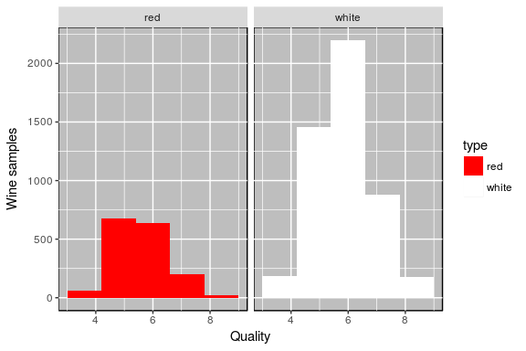

Wines quality and classification - Multivariate Descriptive Statistics
================

Introduction
============

The dataset to analyze is composed of the red and white variants of the Portuguese "Vinho verde" wine. In total, there are 6495 different instances of wines, where 4898 are white wine and 1597 red wine. On the other hand, the dataset has 12 variables based on physicochemical tests on different wines plus two categorical variables, one for grading the wine quality by experts between 0 (very bad) and 10 (very excellent) and another binary variable, 0 = white wine and 1 = red wine. The goal of this project is a) to predict the quality of a wine and b) to classify whether a new wine is red or white, given its attributes.

Preprocessing
=============

The [original](https://archive.ics.uci.edu/ml/datasets/Wine+Quality) datasets consist of two separated files, one for white wines and another for red wines. In this first step, we will combine them into a single dataset.

``` r
# Load libraries
library(readr)
library(ggplot2)
library(corrplot)
library(ppcor)
library(RColorBrewer)
library(mvoutlier)
```

``` r
# Load individual datasets
white <- read_delim("../../data/raw/winequality-white.csv",";", escape_double = FALSE, trim_ws = TRUE)
red <- read_delim("../../data/raw/winequality-red.csv",";", escape_double = FALSE, trim_ws = TRUE)
```

Let us code 0 for white wines and 1 for red wines and set the name of the columns.

``` r
# Create a new column, where 0 indicates white wine and 1 red wine.
white$type = 0
red$type = 1

# Combine both datasets.
df <- rbind(white, red)

# Rename columns.
colnames(df) <- c("fixed_acidity", "volatile_acidity", "citric_acid", "residual_sugar", 
                     "chlorides", "free_sulfur_dioxide", "total_sulfur_dioxide", "density", 
                     "pH", "sulphates", "alcohol", "quality", "type")

# Quality and type are categorical variables.
df$quality <- as.factor(df$quality)
df$type <- as.factor(df$type)
```

Finally, we remove rows with missing values (in this case just 2 entries) and shuffle the dataset in order to mix the different types of wines.

``` r
# Remove missing values.
df <- df[complete.cases(df), ] # two entries.

# Shuffle dataset.
df <- df[sample(nrow(df)),]

# Write dataset into csv file.
write.table(df, file="../../data/processed/wines.csv", sep=";", col.names = TRUE, row.names = FALSE)
```

Analysis of the full dataset
============================

``` r
# Loading the dataset into a dataframe
df <- read_delim("../../data/processed/wines.csv", ";", escape_double = FALSE, trim_ws = TRUE)
```

The following table summarizes the distribution of the quantitative variables, highlighting their minimum, maximum, mean and standard deviation values.

``` r
summary(df)
```

    ##  fixed_acidity    volatile_acidity  citric_acid     residual_sugar  
    ##  Min.   : 3.800   Min.   :0.0800   Min.   :0.0000   Min.   : 0.600  
    ##  1st Qu.: 6.400   1st Qu.:0.2300   1st Qu.:0.2500   1st Qu.: 1.800  
    ##  Median : 7.000   Median :0.2900   Median :0.3100   Median : 3.000  
    ##  Mean   : 7.215   Mean   :0.3396   Mean   :0.3187   Mean   : 5.444  
    ##  3rd Qu.: 7.700   3rd Qu.:0.4000   3rd Qu.:0.3900   3rd Qu.: 8.100  
    ##  Max.   :15.900   Max.   :1.5800   Max.   :1.6600   Max.   :65.800  
    ##    chlorides       free_sulfur_dioxide total_sulfur_dioxide
    ##  Min.   :0.00900   Min.   :  1.00      Min.   :  6.0       
    ##  1st Qu.:0.03800   1st Qu.: 17.00      1st Qu.: 77.0       
    ##  Median :0.04700   Median : 29.00      Median :118.0       
    ##  Mean   :0.05602   Mean   : 30.52      Mean   :115.8       
    ##  3rd Qu.:0.06500   3rd Qu.: 41.00      3rd Qu.:156.0       
    ##  Max.   :0.61100   Max.   :289.00      Max.   :440.0       
    ##     density             pH          sulphates         alcohol     
    ##  Min.   :0.9871   Min.   :2.720   Min.   :0.2200   Min.   : 8.00  
    ##  1st Qu.:0.9923   1st Qu.:3.110   1st Qu.:0.4300   1st Qu.: 9.50  
    ##  Median :0.9949   Median :3.210   Median :0.5100   Median :10.30  
    ##  Mean   :0.9947   Mean   :3.219   Mean   :0.5313   Mean   :10.49  
    ##  3rd Qu.:0.9970   3rd Qu.:3.320   3rd Qu.:0.6000   3rd Qu.:11.30  
    ##  Max.   :1.0390   Max.   :4.010   Max.   :2.0000   Max.   :14.90  
    ##     quality           type       
    ##  Min.   :3.000   Min.   :0.0000  
    ##  1st Qu.:5.000   1st Qu.:0.0000  
    ##  Median :6.000   Median :0.0000  
    ##  Mean   :5.819   Mean   :0.2459  
    ##  3rd Qu.:6.000   3rd Qu.:0.0000  
    ##  Max.   :9.000   Max.   :1.0000

Distribution of target variables
--------------------------------

### Type

As we have already seen, the distribution of the `type` of wines is considerably unbalanced, since the 75% of the observations are white wines, and the other 25% are red wines. One of the goals of this project will be classifying if a new wine is red or white according to its attributes.

``` r
type.0 = subset(df, type==0)
type.1 = subset(df, type==1)
type.0$type <- 'white'
type.1$type <- 'red'
types <- rbind(type.0, type.1)
types$type = as.factor(types$type)

ggplot(types, aes(type, ..count..)) + geom_bar(aes(fill=type)) + scale_fill_manual(values=c("red","white")) +
  theme(panel.background = element_rect(fill = 'grey', colour = 'black'), plot.title= element_text(hjust = 0.5))
```


### Quality

The `quality` is actually a categorical variable, as we can see in the following histogram. However, we will treat it as a continuous variable within the regression modeling to predict the quality of a new wine.

``` r
ggplot(types, aes(quality))  + geom_histogram(aes(fill=type), bins=6) + 
  scale_fill_manual(values=c("red","white")) + ylab("Wine samples") + xlab("Quality") + facet_grid(. ~ type) +
  theme(panel.background = element_rect(fill = 'grey', colour = 'black'), plot.title= element_text(hjust = 0.5))
```



Correlation analysis
--------------------

Let us now study the linear relationships between wine quantitative variables. The variables to be inspected are the quantitative attributes `fixed_acidity`, `volatile_acidity`, `citric_acid`, `residual_sugar`, `chlorides`, `free_sulfur_dioxide`, `total_sulfur_dioxide`, `density`, `pH`, `sulphates` and `alcohol`. We have decided to maintain these 11 variables and do not try to reduce them using a PCA analysis because we are interested in the original meaning and interpretation..

``` r
r <- cor(df[,1:11])
partial.corr <- pcor(df[,1:11])$estimate
corrplot(r, method="ellipse")
```


As we can see, the linear relations between variables are weak (the tonality of the colors is, in general, soft). We can only assure that `free_sulfur_dioxide` obviously is positive related with the `total_sulfur_dioxide`. Also the `alcohol` has negative effects on the `density` of the wines. To conclude, it is interesting to mention that the `sulphates` does not seem linearly related with any of the other variables.

Coefficients of determination
-----------------------------

The coefficients of determination can also give us a good insight into linear relationships within the data. As Table below displays, important linear relations are present in this set. Specifically, `density` and `residual_sugar` are the most linearly explained by the other variables. Slightly less influenced, but still scoring high, are `fixed_acidity` and `alcohol`.

``` r
r2multv<-function(x){
  r2s=1-1/(diag(solve(cov(x)))*diag(cov(x)))
  r2s
}

r2multv(df[,1:11])
```

    ##        fixed_acidity     volatile_acidity          citric_acid 
    ##            0.7957831            0.4866891            0.3776351 
    ##       residual_sugar            chlorides  free_sulfur_dioxide 
    ##            0.8616690            0.3870994            0.5324288 
    ## total_sulfur_dioxide              density                   pH 
    ##            0.6598145            0.9371628            0.6058479 
    ##            sulphates              alcohol 
    ##            0.3513432            0.7908480

Effective dependence coefficient of the R matrix
------------------------------------------------

``` r
1-det(cor(df[,1:11]))^(1/11)
```

    ## [1] 0.4052199

Until this point, our analysis shows weak linear relations in this dataset. Further proof of this fact can be found in the effective dependence coefficient of the R matrix: D(R) = 0.4052199. This means that, altogether, linear dependences explain only 40% of the variability of the data. Hence, the linear regression model will probably not perform well in this dataset.
