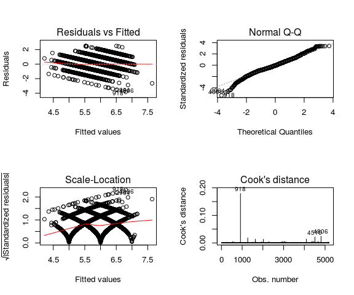

Wines quality and classification - Linear Regression
================

Introduction
============

The aim of this section is to use linear regression to model and predict a wine's quality based on its physicochemical attributes. To do this, we will consider the variable `quality` as a continuous variable ranging from 0 to 10. It is worth noting, however, that this variable is originally a categorical one which can only take one of the 11 integer values comprised between 0 and 10. Therefore, as predictions will be continuous, many of them will most likely be slightly off due to this discrepancy. This should not pose a problem, as the usual error metrics, such as RMSE, can be obtained anyways.

``` r
# Load libraries
library(readr)
library(dplyr)
library(tseries)
library(lmtest)
```

``` r
# Load dataset
df <- read_delim("../../data/processed/wines.csv", ";", escape_double = FALSE, trim_ws = TRUE)
```

Model fitting
=============

After splitting the data in training and test sets, the training set was used to fit a linear regression model. At first, all variables were used as explanatory variables for the model.

``` r
# Train and test dataset, split 80% (data has been shuffled previously, no need to sample randomly)
split <- nrow(df)*0.8
train <- df[1:split,]
test <- df[split:nrow(df),]

# Fit the model using all variables
model1 <- lm(quality~fixed_acidity+volatile_acidity+citric_acid
            +residual_sugar+chlorides+free_sulfur_dioxide
            +total_sulfur_dioxide+density+pH+sulphates+alcohol, data=train)
summary(model1)
```

    ## 
    ## Call:
    ## lm(formula = quality ~ fixed_acidity + volatile_acidity + citric_acid + 
    ##     residual_sugar + chlorides + free_sulfur_dioxide + total_sulfur_dioxide + 
    ##     density + pH + sulphates + alcohol, data = train)
    ## 
    ## Residuals:
    ##     Min      1Q  Median      3Q     Max 
    ## -3.8105 -0.4612 -0.0391  0.4730  2.4941 
    ## 
    ## Coefficients:
    ##                        Estimate Std. Error t value Pr(>|t|)    
    ## (Intercept)           5.621e+01  1.301e+01   4.320 1.59e-05 ***
    ## fixed_acidity         6.628e-02  1.720e-02   3.854 0.000118 ***
    ## volatile_acidity     -1.310e+00  8.650e-02 -15.147  < 2e-16 ***
    ## citric_acid          -5.320e-02  8.775e-02  -0.606 0.544353    
    ## residual_sugar        4.444e-02  5.698e-03   7.799 7.47e-15 ***
    ## chlorides            -3.814e-01  3.765e-01  -1.013 0.311161    
    ## free_sulfur_dioxide   6.372e-03  8.347e-04   7.634 2.70e-14 ***
    ## total_sulfur_dioxide -2.620e-03  3.098e-04  -8.457  < 2e-16 ***
    ## density              -5.549e+01  1.328e+01  -4.179 2.98e-05 ***
    ## pH                    4.603e-01  9.970e-02   4.617 3.98e-06 ***
    ## sulphates             6.796e-01  8.345e-02   8.144 4.75e-16 ***
    ## alcohol               2.711e-01  1.832e-02  14.800  < 2e-16 ***
    ## ---
    ## Signif. codes:  0 '***' 0.001 '**' 0.01 '*' 0.05 '.' 0.1 ' ' 1
    ## 
    ## Residual standard error: 0.7314 on 5184 degrees of freedom
    ## Multiple R-squared:  0.2974, Adjusted R-squared:  0.2959 
    ## F-statistic: 199.4 on 11 and 5184 DF,  p-value: < 2.2e-16

However, the marginal coefficient test for each of the variables indicates that the *p*-values for citric acid and chlorides are not low enough to reject the null hypothesis. Thus, we can consider that the contribution of these to the variance of quality is not significantly greater than 0, and so they have been removed from the final model. The resulting linear regression model is described below:

``` r
# Citric_acid removed from the model
model1 <- update(model1, ~.-citric_acid)
# Check if chlorides can also be removed
summary(model1)
```

    ## 
    ## Call:
    ## lm(formula = quality ~ fixed_acidity + volatile_acidity + residual_sugar + 
    ##     chlorides + free_sulfur_dioxide + total_sulfur_dioxide + 
    ##     density + pH + sulphates + alcohol, data = train)
    ## 
    ## Residuals:
    ##     Min      1Q  Median      3Q     Max 
    ## -3.8024 -0.4604 -0.0403  0.4726  2.4954 
    ## 
    ## Coefficients:
    ##                        Estimate Std. Error t value Pr(>|t|)    
    ## (Intercept)           5.623e+01  1.301e+01   4.322 1.58e-05 ***
    ## fixed_acidity         6.379e-02  1.670e-02   3.820 0.000135 ***
    ## volatile_acidity     -1.290e+00  8.009e-02 -16.111  < 2e-16 ***
    ## residual_sugar        4.434e-02  5.695e-03   7.785 8.33e-15 ***
    ## chlorides            -4.191e-01  3.713e-01  -1.129 0.259043    
    ## free_sulfur_dioxide   6.386e-03  8.344e-04   7.654 2.31e-14 ***
    ## total_sulfur_dioxide -2.652e-03  3.053e-04  -8.687  < 2e-16 ***
    ## density              -5.552e+01  1.328e+01  -4.181 2.95e-05 ***
    ## pH                    4.642e-01  9.949e-02   4.666 3.16e-06 ***
    ## sulphates             6.772e-01  8.335e-02   8.125 5.55e-16 ***
    ## alcohol               2.701e-01  1.824e-02  14.806  < 2e-16 ***
    ## ---
    ## Signif. codes:  0 '***' 0.001 '**' 0.01 '*' 0.05 '.' 0.1 ' ' 1
    ## 
    ## Residual standard error: 0.7314 on 5185 degrees of freedom
    ## Multiple R-squared:  0.2973, Adjusted R-squared:  0.2959 
    ## F-statistic: 219.4 on 10 and 5185 DF,  p-value: < 2.2e-16

``` r
# It can indeed be removed, do it
model1 <- update(model1, ~.-chlorides)
summary(model1)
```

    ## 
    ## Call:
    ## lm(formula = quality ~ fixed_acidity + volatile_acidity + residual_sugar + 
    ##     free_sulfur_dioxide + total_sulfur_dioxide + density + pH + 
    ##     sulphates + alcohol, data = train)
    ## 
    ## Residuals:
    ##     Min      1Q  Median      3Q     Max 
    ## -3.7996 -0.4597 -0.0391  0.4691  2.4932 
    ## 
    ## Coefficients:
    ##                        Estimate Std. Error t value Pr(>|t|)    
    ## (Intercept)           5.923e+01  1.274e+01   4.651 3.39e-06 ***
    ## fixed_acidity         6.624e-02  1.656e-02   4.001 6.40e-05 ***
    ## volatile_acidity     -1.304e+00  7.923e-02 -16.454  < 2e-16 ***
    ## residual_sugar        4.580e-02  5.546e-03   8.258  < 2e-16 ***
    ## free_sulfur_dioxide   6.342e-03  8.335e-04   7.609 3.26e-14 ***
    ## total_sulfur_dioxide -2.622e-03  3.041e-04  -8.621  < 2e-16 ***
    ## density              -5.864e+01  1.299e+01  -4.515 6.47e-06 ***
    ## pH                    4.859e-01  9.762e-02   4.978 6.64e-07 ***
    ## sulphates             6.593e-01  8.183e-02   8.057 9.60e-16 ***
    ## alcohol               2.701e-01  1.825e-02  14.802  < 2e-16 ***
    ## ---
    ## Signif. codes:  0 '***' 0.001 '**' 0.01 '*' 0.05 '.' 0.1 ' ' 1
    ## 
    ## Residual standard error: 0.7314 on 5186 degrees of freedom
    ## Multiple R-squared:  0.2971, Adjusted R-squared:  0.2959 
    ## F-statistic: 243.6 on 9 and 5186 DF,  p-value: < 2.2e-16

According to the obtained model, the two variables with the highest influence on quality are `volatile acidity` and `density`, specially the latter. This can be misleading however, as it represents the variation in quality per unit of the input, and the scales of the input variables differ in their order of magnitude. Checking the distribution of `density` (`introduction` notebook), for example, the difference between the maximum and minimum values is lower than 0.03, whereas `total_sulfur_dioxide` has a range of over 400. In any case, some conclusions can be extracted from this output. For example, denser wines tend to have a smaller perceived quality due to the negative coefficient, and, on the contrary, those with higher alcohol contents obtain higher quality perception.

The adjusted R-squared coefficient of the resulting model is rather low, with a value of only 0.29. The regression overall *p*-value, however, is low enough for us to be confident that there exists a relationship between at least part of the input and the output variable, `quality`, performing better than just the simple constant model.

Assessing the model: assumptions
--------------------------------

Let us further examine the quality of the linear regression model by checking if the assumptions are met. In particular, we are interested in testing the linearity of the model and if the residuals are independent, normal and have constant variance (LINE conditions).

``` r
# Check the assumptions
# Linearity
raintest(model1) # Yes, linear
```

    ## 
    ##  Rainbow test
    ## 
    ## data:  model1
    ## Rain = 1.0618, df1 = 2598, df2 = 2588, p-value = 0.06349

``` r
# Test normality
jarque.bera.test(residuals(model1)) # Answer: No normality
```

    ## 
    ##  Jarque Bera Test
    ## 
    ## data:  residuals(model1)
    ## X-squared = 228.84, df = 2, p-value < 2.2e-16

``` r
# Equal variances
bptest(model1) # No constant variance
```

    ## 
    ##  studentized Breusch-Pagan test
    ## 
    ## data:  model1
    ## BP = 89.05, df = 9, p-value = 2.525e-15

``` r
# Testing independence of the residuals
dwtest(model1, alternative="two.sided") # Not independent
```

    ## 
    ##  Durbin-Watson test
    ## 
    ## data:  model1
    ## DW = 1.9971, p-value = 0.916
    ## alternative hypothesis: true autocorrelation is not 0

The conducted tests have different results. First of all, the Rainbow test tests the linear relationship between the response and the linear predictor. The *p*-value is high enough to not reject the null hypothesis (0.4325) but in other datasets this value is closer to 1. On the other hand, the Durbin-Watson test returns a high *p*-value (0.7377), sign that there is not enough evidence to reject the null hypothesis of autocorrelation of the residuals. Hence, the residuals can be considered as independent. The results for the Jarque-Bera and Breusch-Pagan tests, however, are not so positive. According to their results, residuals are neither normal nor homoscedastic.



Although the residual plots of the above figure are unusual due to the clustering around the integer values, they confirm the previous results. The Normal Q-Q plot is in line with the results of the Jarque-Bera test, showing departures from normality, specially in the first quartiles. From the Cook's distance plot, a significant outlier can be seen, corresponding to observation 4446. Even if we remove this outlier, the statistical assumptions remain the same.

Evaluation of results
---------------------

The final step is to evaluate the performance of the model. In order to do so, let us measure the accuracy of predictions by calculating the value of our error metric of choice: RMSE. The standard deviation of our data will be used as a reference to assess the correctness of RMSE values.

``` r
# Standard deviation of our data
sd(df$quality)
```

    ## [1] 0.8732716

``` r
# Assess the model
predicted <- predict(model1, test)
rmse <- (sqrt(mean((test$quality - predicted)^2)))
rmse
```

    ## [1] 0.7532975

As the results above show, our predicted variable `quality` has a standard deviation of *σ* = 0.87. When fed with the test set, the linear regression model outputs predictions with an RMSE = 0.74. Therefore, and in line with what has been stated before, the interpretation of these results is positive, as RMSE is lower than the data's standard deviation.

Alternative model based on the sweetness of wines
=================================================

We can try to improve the validation and interpretation of the model by defining a new categorical variable, `residual_sugar2`, which divides wines in three groups according on their [sweetness](https://en.wikipedia.org/wiki/Sweetness_of_wine#Residual_sugar). The sweetness of the wines is defined by its residual sugar, and commonly the classification is `dry` wines for values up to 4 g/l, `medium_dry` up to 12 g/l, `medium` up to 45 g/l and `sweet` more than 45 g/l. In out dataset, the highest value for `residual_sugar` is 18, thus we only consider the first three clusters:

``` r
# Adding the new attribute
df$residual_sugar2 <- df$residual_sugar
df$residual_sugar2[df$residual_sugar < 4.0] <- "dry"
df$residual_sugar2[df$residual_sugar >= 4.0 & df$residual_sugar < 12.0] <- "medium dry"
df$residual_sugar2[df$residual_sugar >= 12.0] <- "medium"

df$residual_sugar2 <- as.factor(df$residual_sugar2)
df$residual_sugar2 <- relevel(df$residual_sugar2, ref="dry")

# Update train and test sets 
train <- df[1:split,]
test <- df[split:nrow(df),]

model2 <- update(model1, ~.+residual_sugar2+residual_sugar:residual_sugar2)
summary(model2)
```

    ## 
    ## Call:
    ## lm(formula = quality ~ fixed_acidity + volatile_acidity + residual_sugar + 
    ##     free_sulfur_dioxide + total_sulfur_dioxide + density + pH + 
    ##     sulphates + alcohol + residual_sugar2 + residual_sugar:residual_sugar2, 
    ##     data = train)
    ## 
    ## Residuals:
    ##     Min      1Q  Median      3Q     Max 
    ## -3.8922 -0.4624 -0.0376  0.4596  2.4815 
    ## 
    ## Coefficients:
    ##                                            Estimate Std. Error t value
    ## (Intercept)                               6.402e+01  1.334e+01   4.800
    ## fixed_acidity                             6.492e-02  1.691e-02   3.838
    ## volatile_acidity                         -1.339e+00  7.975e-02 -16.789
    ## residual_sugar                            1.431e-01  2.274e-02   6.292
    ## free_sulfur_dioxide                       6.227e-03  8.364e-04   7.445
    ## total_sulfur_dioxide                     -2.567e-03  3.066e-04  -8.373
    ## density                                  -6.351e+01  1.359e+01  -4.672
    ## pH                                        4.882e-01  9.854e-02   4.954
    ## sulphates                                 6.396e-01  8.222e-02   7.779
    ## alcohol                                   2.593e-01  1.930e-02  13.439
    ## residual_sugar2medium                     3.730e-01  1.508e-01   2.474
    ## residual_sugar2medium dry                 2.818e-01  7.765e-02   3.629
    ## residual_sugar:residual_sugar2medium     -1.076e-01  2.301e-02  -4.677
    ## residual_sugar:residual_sugar2medium dry -1.125e-01  2.325e-02  -4.840
    ##                                          Pr(>|t|)    
    ## (Intercept)                              1.63e-06 ***
    ## fixed_acidity                            0.000125 ***
    ## volatile_acidity                          < 2e-16 ***
    ## residual_sugar                           3.40e-10 ***
    ## free_sulfur_dioxide                      1.13e-13 ***
    ## total_sulfur_dioxide                      < 2e-16 ***
    ## density                                  3.07e-06 ***
    ## pH                                       7.51e-07 ***
    ## sulphates                                8.76e-15 ***
    ## alcohol                                   < 2e-16 ***
    ## residual_sugar2medium                    0.013379 *  
    ## residual_sugar2medium dry                0.000287 ***
    ## residual_sugar:residual_sugar2medium     2.99e-06 ***
    ## residual_sugar:residual_sugar2medium dry 1.34e-06 ***
    ## ---
    ## Signif. codes:  0 '***' 0.001 '**' 0.01 '*' 0.05 '.' 0.1 ' ' 1
    ## 
    ## Residual standard error: 0.7297 on 5182 degrees of freedom
    ## Multiple R-squared:  0.3009, Adjusted R-squared:  0.2991 
    ## F-statistic: 171.5 on 13 and 5182 DF,  p-value: < 2.2e-16

``` r
# Test linearity
raintest(model2) # Yes, linear
```

    ## 
    ##  Rainbow test
    ## 
    ## data:  model2
    ## Rain = 1.0566, df1 = 2598, df2 = 2584, p-value = 0.08055

``` r
# Test normality
jarque.bera.test(residuals(model2)) # Answer: No normality
```

    ## 
    ##  Jarque Bera Test
    ## 
    ## data:  residuals(model2)
    ## X-squared = 232.01, df = 2, p-value < 2.2e-16

``` r
# Equal variances
bptest(model2) # No constant variance
```

    ## 
    ##  studentized Breusch-Pagan test
    ## 
    ## data:  model2
    ## BP = 98.312, df = 13, p-value = 3.521e-15

``` r
# Testing independence of the residuals
dwtest(model2, alternative="two.sided") # Not independent
```

    ## 
    ##  Durbin-Watson test
    ## 
    ## data:  model2
    ## DW = 1.9991, p-value = 0.9731
    ## alternative hypothesis: true autocorrelation is not 0

``` r
# Assess the model
predicted2 <- predict(model2, test)
rmse <- (sqrt(mean((test$quality - predicted2)^2)))
rmse
```

    ## [1] 0.749174

In comparison with the previous model, the R-squared coeffient has improved slightly. The model's assumptions, however, remain the same: residuals are linear, but they are not normal and their variance is still not constant either. RMSE does not change significantly, differing in less than 0.01 from the previous measure.

Overall, the improvement in R-squared does not justify the effort to include a new attribute, as a) it is very slight, b) the model's assumptions are still not met, and c) RMSE has not improved as a consequence of it. It is true, however, that by looking at the coefficients, some information can be derived about the impact of sweetness on quality. Specifically, medium wines seem to have higher quality rankings than medium-dry ones, which in turn are ranked better than dry wines.

Conclusions
===========

wine quality. Even though the it does not have a very high R-squared coefficient, the RMSE metric is low enough for us to consider it an interesting option to predict a wine's quality. Some remarks can be made, however. First of all, our input data is not uniformly distributed, with a majority of the observations taking quality values between 4 and 6. Thus, our model could be slightly overfitted for those kind of values, and there is a risk that the precision of results could drop if the input data happened to contain more extreme values.

Besides, it would be interesting to try a different approach to this problem, perhaps using a classification technique for prediction instead, although linear regression seems better suited given the features of the output variable.
